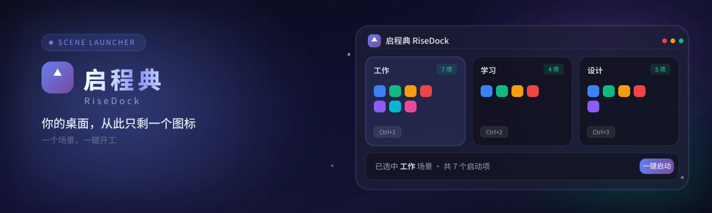

# RiseDock（启程典）

  

  <strong>你的桌面，从此只剩一个图标。</strong> 
  一个场景，一键开工 · 软件 / 文件 / 文件夹 / 网址收进场景 · 点一下按顺序全部启动 
  本地自动备份 · 可恢复

  免费 1 场景 × 3 项 · 白银月卡 ¥9.9 · 黄金季卡 ¥24.9 · 铂金年卡 ¥79 · 永久 ¥128 起

  <a href="https://yottameta.github.io/RiseDock/"><b>官网介绍</b></a> ·
  <a href="https://yottameta.github.io/RiseDock/#download"><b>免费下载</b></a> ·
  Win10 / 11 64 位

---

> **说明：** 本仓库 **不提供源代码**，仅发布 **Windows 安装包**、[产品官网](https://yottameta.github.io/RiseDock/) 与说明。请到 [官网下载区](https://yottameta.github.io/RiseDock/#download) 获取安装包（国内双地址）；也可从 [Releases](https://github.com/YottaMeta/RiseDock/releases) 下载。不要 clone 本仓库期望得到工程源码。

---

## 产品是什么

每天开机都在重复：微信、浏览器、文档、直播工具、IDE……一个个双击。

**RiseDock（启程典）** 把它们收进「场景」，一点即开：

- 按 **场景** 组织应用 / 文件 / 文件夹 / URL（直播 / 上班 / 写代码……）
- **场景置顶**：重要场景钉在首页最上，任意排序都优先；进了分组也能在首页直接启动
- **场景分组**：一层文件夹钻入收纳；删组不丢场景
- **一键启动** 整组工具，可设启动间隔，避免同时挤爆系统
- **拖入添加**：场景详情内可从资源管理器直接拖入文件 / 文件夹（可多选）添加启动项；也支持「+ 添加」与批量添加
- 场景 / 全局 **快捷键**、列表拖拽排序、搜索跳转、导入导出与本地备份
- **授权门禁**：免费额度可用；过期冻结超额内容，续费后恢复（数据不删）

适合：开工一键拉齐工具链、多客户/多项目切换——**不是**应用商店，也不是远程桌面。

想一眼看懂 → **[官网落地页](https://yottameta.github.io/RiseDock/)**
---

## 下载与安装

安装包约数 MB。**国内用户请用官网双地址**（发版后会同步更新）：

| 地址 | 链接 |
|------|------|
| ① 蓝奏云（推荐） | https://wwbrt.lanzouu.com/b01euo8frg · 密码 **`brza`** |
| ② GitHub Releases | https://github.com/YottaMeta/RiseDock/releases |
| 说明页 | [官网下载区](https://yottameta.github.io/RiseDock/#download) |

| 步骤 | 操作 |
|------|------|
| 1 | 打开上表任一地址，下载 `RiseDock_*-setup.exe` |
| 2 | 若 Windows SmartScreen 提示「无法识别」→ **更多信息** → **仍要运行** |
| 3 | 按向导安装后启动 |

**系统要求**

| 项 | 要求 |
|----|------|
| 系统 | Windows 10 / 11 64 位 |
| 运行时 | 安装程序会处理 **WebView2**；离线请预装 [WebView2](https://developer.microsoft.com/microsoft-edge/webview2/#download-section) |
| 网络 | 检查更新需联网；授权为本地校验 |

---

## 已安装用户 · 检查更新

应用内：**设置 → 检查更新**（或菜单中的更新入口）。  
更新通道由官方维护；请只从本仓库 Releases / 官方更新通道获取安装包。

---

## 常见问题

| 问题 | 说明 |
|------|------|
| SmartScreen 拦安装 | 未做 Windows Authenticode 商业签名时常见；选「仍要运行」 |
| 免费能用多少 | 未激活：最多 1 个场景、每场景最多 3 个启动项 |
| 授权过期 | 保留最早场景与最早 3 项可用，其余冻结；数据不删，续费后恢复 |
| 想看源码 | 本仓库故意不开放源码；仅 Releases 与本 README |

---

## 隐私与安全

- 场景与启动项数据保存在本机
- 授权校验为 **本地** 逻辑（含时间回拨防护）
- 安装包更新走官方 updater，**安装前验签**

---

## 版本

以 [Releases](https://github.com/YottaMeta/RiseDock/releases) 最新 tag 为准（形如 `v1.2.2`）。

---

## 联系

通过你购买渠道 / 客服入口联系作者。请勿在本仓库 Issues 期望得到源码支持。
